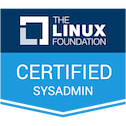
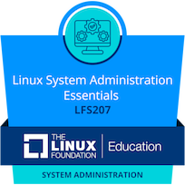

## Hi there 👋

Passionate about creating useful things.

Based in Poland, Lubuskie taking a step from hobby onto professional career.

---

### I'm into:
🔹**Linux** - long-time Linux user, certified by Linux Foundation: knowledge of shell scripting, text processing, managing users, disks and processes. I am familliar with git repositories. I can work with Linux man pages and I am a quick learner.

🔹**Python** - is my current language of choice due to simplicity and large amount of resources. I have used Flask Framework in my projects. 

🔹**MySQL** - I can design and maintain basic MySQL databases. I would like to expand my skills to more complexed projects. 

🔹**Docker** - I have utilized Docker containers to host my projects. I have a little experience with deployment to AWS products.

🔹eager to use my knowledge in professional work and learn more technologies developing carrer path.

### Building up a portfolio:

---

### The most proud of [ObliczaKalisza](https://github.com/dhpasta/ObliczaKalisza)
Still under development project I have created to make my job easier and be able to serve more people.

A lot of experience gained over **five** editions of event and much more ideas to implement on list!
